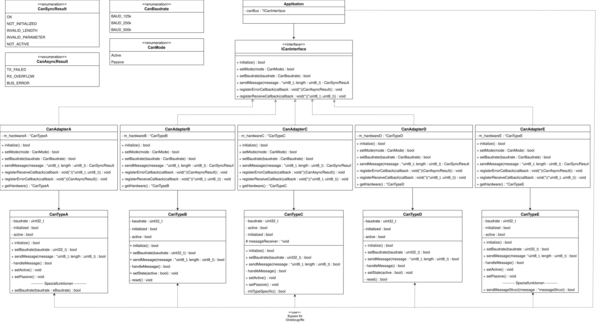

# CAN Bus Assessment
[](https://thomas-littmann.github.io/Assessment/annotated.html)

Dieses Repository enthält meine Lösung für das CAN-Bus Assessment, das als Teil des Bewerbungsprozesses gestellt wurde.  
Die Aufgabe war, eine einheitliche Schnittstelle für verschiedene CAN-Hardwaretypen zu implementieren und die Hardwareanbindung so zu gestalten, dass zukünftige Erweiterungen möglichst einfach möglich sind.

---

## Architektur & UML

Die Architektur besteht aus vier Schichten:

1. **Applikation**: Nutzt die einheitliche Schnittstelle (`ICanInterface`) und greift nur in Ausnahmefällen direkt auf die Hardware zu.  
2. **Einheitliche Schnittstelle** (`ICanInterface`): Sorgt dafür, dass die Applikation unabhängig von der konkreten Hardware ist.  
3. **Hardware-Adapter** (`CanAdapterA/B/C/D/E`): Adapterklassen, welche die jeweiligen Hardware-Klassen (`CanTypeA/B/C/D/E`) kapseln und auf die einheitliche Schnittstelle abbilden.
4. **Hardware-Klassen** (`CanTypeA/B/C/D/E`): Repräsentieren die konkrete CAN-Hardware und enthalten die hardware-spezifischen Implementierungen. Diese wurden in der Aufgabe gegeben.


Hier ist das UML-Klassendiagramm der implementierten Lösung:



*Hinweis:* Spezialfunktionen der Hardware, die nicht Teil der einheitlichen Schnittstelle sind, können von der Applikation direkt genutzt werden. Die Adresse hierfür liefert jeweils die Methode getHardware() der Adapter.

---

## Designentscheidungen

- **Adapter-Muster:**  
  Adapter wurden gewählt, um die Unterschiede in den Hardware-APIs zu kapseln. Das erleichtert es, neue CAN-Hardware anzubinden, ohne die Applikation anzupassen.  

- **Callbacks:**  
  Die einheitliche Schnittstelle unterstützt die Registrierung von Callbacks für asynchrones Empfangen von Nachrichten und Fehlern.
  Die Adapter speichern die registrierten Funktionen.
  Eine vollständige Implementierung müsste die Hardware-Ereignisse (z. B. eingehende Nachrichten in `CanTypeC`) an die registrierten Callbacks weiterleiten.

- **setMode Unterschiede:**  
  Einige Hardwaretypen verwenden `setActive()`/`setPassive()`, andere `setState(bool)`. Die Adapter übersetzen diese Unterschiede einheitlich in `ICanInterface::setMode(CanMode)`.  

- **Baudrate:**  
  Einheitliches Enum `CanBaudrate` (125k, 250k, 500k) wird in hardware-spezifische Werte übersetzt.  

- **Direktzugriff auf Spezialfunktionen:**  
  Über `getHardware()` kann die Applikation die Adresse der Hardware lesen, und dann direkt auf hardwareeigene Spezialfunktionen zugreifen (bspt. über Downcast).
  Die Spezialfunktionen sind hier `setBaudrate(eBaudrate br)` in `CanTypeA` und `sendMessageStruct(messageStruct* message)` in `CanTypeE`.

---

## Ordnerstruktur

```
Assignment/
├── include/
│   ├── ICanInterface.h       # Definition des einheitlichen Interfaces
│   ├── CanCommon.h           # Gemeinsame Datentypen & Enums (z.B standardisierte Baudrate, Fehlermeldungen und Statusmeldungen)
│   │
│   ├── CanAdapters/          # Implementierung der Adapter-Logik
│   │   ├── CanAdapterA.h
│   │   ├── CanAdapterB.h
│   │   ├── CanAdapterC.h
│   │   ├── CanAdapterD.h
│   │   └── CanAdapterE.h
│   │
│   └── CanTypes/             # In Aufgabe gegebene Hardware-Schnittstellen (Typ A-E)
│       ├── CanTypeA.h
│       ├── CanTypeB.h
│       ├── CanTypeC.h
│       ├── CanTypeD.h
│       └── CanTypeE.h
│
└── README.md
```

## Persönliche Anmerkung
Ich habe versucht, die Lösung **klar, wartbar und erweiterbar** zu gestalten und dabei auf **Lesbarkeit und Struktur** zu achten.  
Mir war es besonders wichtig, die Adapter sauber zu implementieren, damit neue Hardware ohne Änderungen in der Applikation genutzt werden kann.

Ein weiterer Gedanke war, ein Template als Vorbild für Adapter zu definieren und gemeinsame Methoden wie `initialize()` bereitzustellen.  
Darauf wurde jedoch verzichtet, da die Hardwares einige Funktionalitäten unterschiedlich implementieren.  
Ein Beispiel ist die Verwendung von `setState(bool)` in `CanTypeB`, während andere Hardwares `setActive()` und `setPassive()` verwenden.

Da nicht absehbar ist, wie neue Hardware die Grundfunktionalitäten implementieren wird, erscheint mir die **Adapter-Lösung** als flexibler und wartungsfreundlicher Ansatz.
